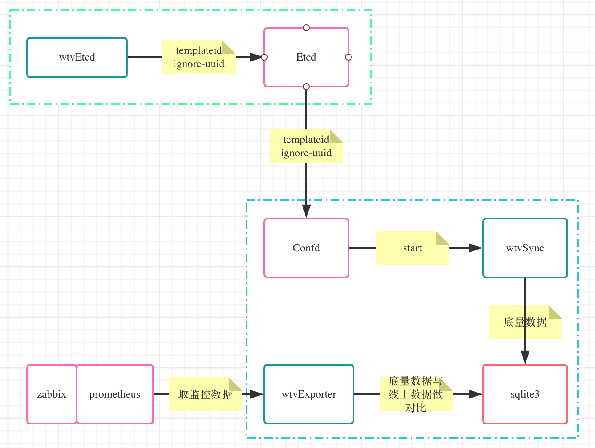

## 概述

全国直播节目单监控，支持的监控数据格式zabbix，prometheus。


## 架构图




## 监控值说明


| 监控值说明              | zabbix | promethues |
| :-----                 | :---- | :----: |
| 频道缺失                | programs lack | -1 |
| 频道节目单OK            | programs ok | 0 |
| 频道节目单数据为空        | programs null | 1 |
| 频道没有直播节目单        | programs now miss | 2 |
| 频道没有预加载节目单      | programs future miss | 3 |
| 频道预加载节目单不完整     | programs future less | 4 |
| 频道预加载节目单时间不连续 | programs future uncontinuity | 5 |
| 频道预加载节目单时间重叠   | programs future overlap | 6 |
| 频道今日节目单为空        | programs today miss | 7 |


## 安装部署

1. zabbix

   ```shell
   [root@cmsc_memcache_204 ~]# cat /usr/local/zabbix/etc/zabbix_agentd.conf.d/memdiff.conf
   UserParameter=uuiddetail,cat /tmp/Monitor/apidata/uuiddiff | grep -v template
   UserParameter=programsfail,cat /tmp/Monitor/apidata/alldaydiff | grep -w "0"
   UserParameter=programsnull,cat /tmp/Monitor/apidata/alldaydiff | grep -w "null"
   UserParameter=programstoday,cat /tmp/Monitor/apidata/alldaydiff | grep -w "today"
   UserParameter=programsnow,cat /tmp/Monitor/apidata/alldaydiff | grep -w "now"
   UserParameter=programsfuture,cat /tmp/Monitor/apidata/alldaydiff | grep -w "future" | grep -w "miss"
   UserParameter=programsless,cat /tmp/Monitor/apidata/alldaydiff | grep -w "less"
   UserParameter=programsuncontinuity,cat /tmp/Monitor/apidata/alldaydiff | grep -w "uncontinuity"
   #UserParameter=programsoverlap,cat /tmp/Monitor/apidata/alldaydiff | grep -w "overlap"
   ```

2. prometheus

   ```yaml
     - job_name: 节目单
       scrape_interval: 300s
       metrics_path: /metrics
       static_configs:
       - labels:
           idc: wtv
         targets:
         - 192.168.0.1:9001
   ```

   

## License

[MIT]

Copyright (c) 2020-present plsof